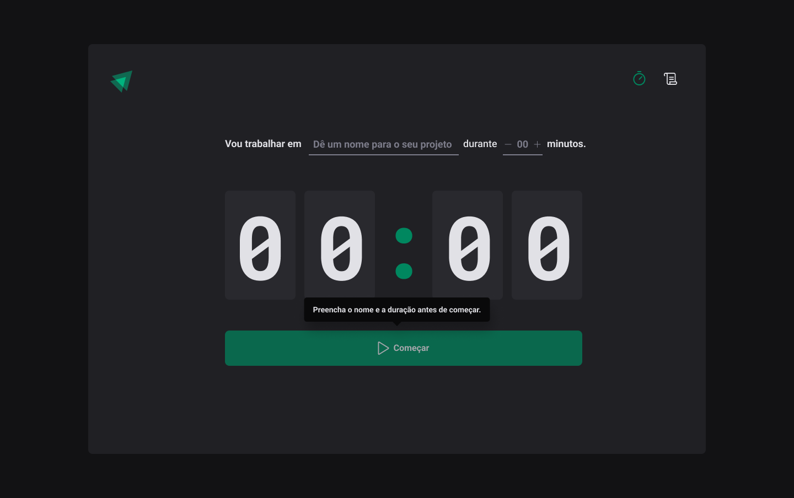

<h1 align="center"> Pomodoro </h1>

Programa exclusivo e gratuito, promovido pela Rocketseat para ensino de tecnologias WEB.  
<a href="https://lp.rocketseat.com.br/devlinks/inscricao?utm_source=github&utm_medium=descricao&utm_campaign=capture-devlinks&utm_term=organic&utm_content=descricao-github-mayk-brito">Estude esse projeto em formato de vídeo clicando aqui.</a>

  <a href="#-tecnologias">Tecnologias</a>&nbsp;&nbsp;&nbsp;|&nbsp;&nbsp;&nbsp;
  <a href="https://pomodoro-chi-three.vercel.app/">Projeto</a>&nbsp;&nbsp;&nbsp;|&nbsp;&nbsp;&nbsp;
  <a href="https://www.figma.com/community/file/1127351821076435124">Layout</a>&nbsp;&nbsp;&nbsp;|&nbsp;&nbsp;&nbsp;
  <a href="#memo-licença">Licença</a>

  

 

## 🚀 Tecnologias

Esse projeto foi desenvolvido com as seguintes tecnologias:

- Typescrypt
- Styled Components
- React router dom
- context api react
- use reducer react
- Figma

## 💻 Projeto

O Pomodoro é trabalhar em uma tarefa posum tempo específico  e depois tira um tempo dedescanso.

- [Acesse o projeto finalizado, online](https://pomodoro-chi-three.vercel.app/)

- [Assistir aulas](https://rocketseat.com.br/)

## 🔖 Layout

Você pode visualizar o layout do projeto através [DESSE LINK](https://www.figma.com/community/file/1127351821076435124). É necessário ter conta no [Figma](https://figma.com) para acessá-lo.

## Projeto React com Controllers, useState, React Hook Form e Zod
Bem-vindo ao repositório do meu projeto React! Este projeto foi desenvolvido com foco na utilização de controllers para gerenciar a lógica de negócios, useState para o gerenciamento de estados locais, React Hook Form para simplificar a gestão de formulários, e a biblioteca Zod para validar dados de forma eficaz.

## Tecnologias Utilizadas
React: A biblioteca JavaScript para a construção de interfaces de usuário, proporcionando uma abordagem declarativa e eficiente.

Controllers: Utilize controllers para organizar e modularizar a lógica de negócios do seu aplicativo, facilitando a manutenção e reutilização de código.

useState: Aproveite o poder do hook useState para gerenciar estados locais de forma simples e eficaz, tornando seus componentes React mais dinâmicos.

React Hook Form: Simplifique a gestão de formulários em React com o React Hook Form, uma biblioteca que oferece uma abordagem eficiente e declarativa para lidar com validações, envio e manipulação de dados de formulários.

Zod: Utilize a biblioteca Zod para realizar validações de forma eficaz, garantindo a integridade dos dados em seu aplicativo.

## Estrutura do Projeto
markdown
Copy code
/src
  /components
    - ComponenteA.js
    - ComponenteB.js
  /controllers
    - ControladorPrincipal.js
    - OutroControlador.js
  /forms
    - FormularioExemplo.js
  /utils
    - utilitario.js
/src/styles
  - styles.css
Explore a estrutura do projeto para entender como os controllers são integrados aos componentes, como o useState é utilizado para gerenciar estados, como o React Hook Form é implementado para simplificar a gestão de formulários e como a biblioteca Zod é utilizada para validação de dados.

Como Utilizar
Clone este repositório:

bash
Copy code
git clone https://github.com/seu-usuario/seu-projeto.git
Instale as dependências:

bash
Copy code
cd seu-projeto
npm install
Inicie o aplicativo:

bash
Copy code
npm start
Agora você está pronto para explorar o projeto e verificar como controllers, useState, React Hook Form e a biblioteca Zod são integrados.

## Contribuições
Contribuições são bem-vindas! Se você encontrar problemas, bugs ou tiver sugestões para melhorias, sinta-se à vontade para abrir issues ou enviar pull requests.

Obrigado por explorar este repositório! Espero que as práticas utilizando controllers, useState, React Hook Form e Zod sejam úteis para o seu desenvolvimento em React.

Adapte conforme necessário para refletir os detalhes específicos do seu projeto.

## Licença

Esse projeto está sob a licença MIT.

---

Feito com ♥ by Bruna Calheiros  [Participe da nossa comunidade!](https://discord.gg/rocketseat)